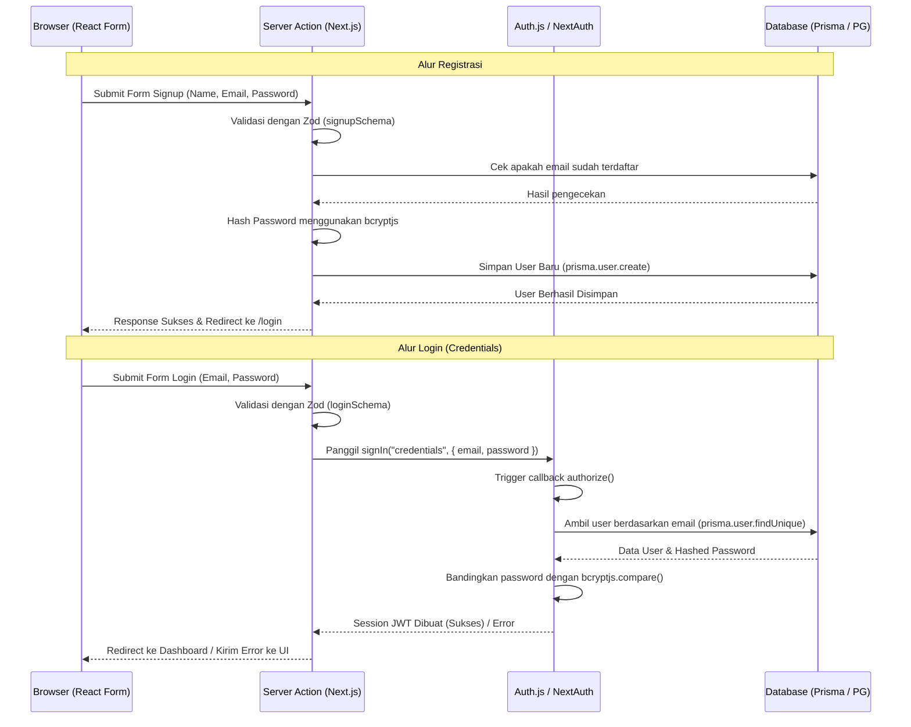

# Panduan Implementasi Autentikasi (Login & Register) menggunakan Auth.js v5, Prisma, & Zod

Dokumen ini berisi panduan dan langkah-langkah detail untuk mengimplementasikan fitur **Login** dan **Register** menggunakan **Credentials Provider** dengan library **Auth.js (NextAuth.js v5)**. Validasi input akan menggunakan **Zod**, dan data akan disimpan ke database PostgreSQL menggunakan **Prisma Client**.

---

## Daftar Isi
1. [Prasyarat & Instalasi Tambahan](#1-prasyarat--instalasi-tambahan)
2. [Arsitektur & Alur Autentikasi](#2-arsitektur--alur-autentikasi)
3. [Struktur File yang Akan Dibuat/Dimodifikasi](#3-struktur-file-yang-akan-dibuatdimodifikasi)
4. [Langkah-Langkah Implementasi Detail](#4-langkah-langkah-implementasi-detail)
   - [Langkah 1: Setup Validasi Zod](#langkah-1-setup-validasi-zod)
   - [Langkah 2: Konfigurasi Auth.js (`auth.ts`)](#langkah-2-konfigurasi-authjs-authts)
   - [Langkah 3: Buat Route Handler Auth.js](#langkah-3-buat-route-handler-authjs)
   - [Langkah 4: Buat Server Actions untuk Autentikasi](#langkah-4-buat-server-actions-untuk-autentikasi)
   - [Langkah 5: Integrasi Komponen Signup (`SignupForm`)](#langkah-5-integrasi-komponen-signup-signupform)
   - [Langkah 6: Integrasi Komponen Login (`LoginForm`)](#langkah-6-integrasi-komponen-login-loginform)
   - [Langkah 7: Konfigurasi Middleware Proteksi Rute](#langkah-7-konfigurasi-middleware-proteksi-rute)
5. [Poin Penting untuk Diperhatikan (Tips Junior Dev)](#5-poin-penting-untuk-diperhatikan-tips-junior-dev)
6. [Langkah Pengujian & Verifikasi](#6-langkah-pengujian--verifikasi)

---

## 1. Prasyarat & Instalasi Tambahan

Karena kita perlu menyimpan password dalam bentuk terenkripsi (hash), kita harus menginstal library untuk hashing password. Gunakan `bcryptjs` agar proses instalasi lebih lancar di berbagai sistem operasi tanpa perlu compile binary C++:

```bash
npm install bcryptjs
npm install -D @types/bcryptjs
```

---

## 2. Arsitektur & Alur Autentikasi



---

## 3. Struktur File yang Akan Dibuat/Dimodifikasi

| Tipe Aksi | File Path | Deskripsi |
| :--- | :--- | :--- |
| **Modifikasi** | [auth.ts](file:///d:/Coding/saas-invoice/auth.ts) | Menambahkan konfigurasi Credentials Provider dan `authorize` callback. |
| **Baru** | [lib/validations/auth.ts](file:///d:/Coding/saas-invoice/lib/validations/auth.ts) | Skema validasi Zod untuk Login dan Register. |
| **Baru** | [app/api/auth/\[...nextauth\]/route.ts](file:///d:/Coding/saas-invoice/app/api/auth/%5B...nextauth%5D/route.ts) | API Route Handler untuk NextAuth. |
| **Baru** | [app/actions/auth-actions.ts](file:///d:/Coding/saas-invoice/app/actions/auth-actions.ts) | Server Actions untuk menangani logika Register dan Login. |
| **Baru** | [middleware.ts](file:///d:/Coding/saas-invoice/middleware.ts) | Middleware Next.js untuk memproteksi halaman dari user tanpa session. |
| **Modifikasi** | [components/signup-form.tsx](file:///d:/Coding/saas-invoice/components/signup-form.tsx) | Menghubungkan Form Signup dengan `registerAction` dan validasi Zod. |
| **Modifikasi** | [components/login-form.tsx](file:///d:/Coding/saas-invoice/components/login-form.tsx) | Menghubungkan Form Login dengan `loginAction` dan validasi Zod. |

---

## 4. Langkah-Langkah Implementasi Detail

### Langkah 1: Setup Validasi Zod
Buat file baru di `lib/validations/auth.ts` untuk mendefinisikan aturan validasi form login dan register agar data yang dikirim ke server selalu valid dan aman.

**Template Kode (`lib/validations/auth.ts`):**
```typescript
import { z } from "zod";

export const loginSchema = z.object({
  email: z.string().email({ message: "Format email tidak valid" }),
  password: z.string().min(1, { message: "Password wajib diisi" }),
});

export const signupSchema = z.object({
  name: z.string().min(2, { message: "Nama minimal terdiri dari 2 karakter" }),
  email: z.string().email({ message: "Format email tidak valid" }),
  password: z.string().min(8, { message: "Password minimal 8 karakter" }),
  confirmPassword: z.string(),
}).refine((data) => data.password === data.confirmPassword, {
  message: "Konfirmasi password tidak cocok",
  path: ["confirmPassword"],
});
```

---

### Langkah 2: Konfigurasi Auth.js (`auth.ts`)
Modifikasi file `auth.ts` di root project untuk menambahkan `CredentialsProvider`. Kita harus memvalidasi data menggunakan `loginSchema` dari Zod, mencocokkan user di DB dengan Prisma, dan membandingkan hashed password.

> [!IMPORTANT]
> Karena kita menggunakan **Credentials Provider**, kita **wajib** menggunakan strategi session **JWT** (`session: { strategy: "jwt" }`). Auth.js secara default menggunakan JWT untuk Credentials karena adapter database tidak mendukung session database untuk login tipe credentials secara langsung.

**Template Kode (`auth.ts`):**
```typescript
import NextAuth from "next-auth";
import Credentials from "next-auth/providers/credentials";
import { prisma } from "@/lib/prisma";
import { PrismaAdapter } from "@auth/prisma-adapter";
import bcrypt from "bcryptjs";
import { loginSchema } from "@/lib/validations/auth";

export const { handlers, signIn, signOut, auth } = NextAuth({
  adapter: PrismaAdapter(prisma),
  session: { strategy: "jwt" }, // Wajib untuk Credentials
  pages: {
    signIn: "/login", // Redirect ke kustom login page jika unauthorized
  },
  providers: [
    Credentials({
      name: "credentials",
      credentials: {
        email: { label: "Email", type: "email" },
        password: { label: "Password", type: "password" },
      },
      async authorize(credentials) {
        // 1. Validasi input menggunakan schema Zod
        const validatedFields = loginSchema.safeParse(credentials);

        if (!validatedFields.success) {
          return null;
        }

        const { email, password } = validatedFields.data;

        // 2. Cari user berdasarkan email di database
        const user = await prisma.user.findUnique({
          where: { email },
        });

        // Jika user tidak ditemukan atau tidak memiliki password (misal login via OAuth sebelumnya)
        if (!user || !user.password) {
          return null;
        }

        // 3. Cocokkan password yang diketik dengan password yang di-hash di DB
        const passwordMatch = await bcrypt.compare(password, user.password);

        if (passwordMatch) {
          return {
            id: user.id,
            name: user.name,
            email: user.email,
          };
        }

        return null;
      },
    }),
  ],
  callbacks: {
    async jwt({ token, user }) {
      if (user) {
        token.id = user.id;
      }
      return token;
    },
    async session({ session, token }) {
      if (session.user) {
        session.user.id = token.id as string;
      }
      return session;
    },
  },
});
```

---

### Langkah 3: Buat Route Handler Auth.js
Buat file di `app/api/auth/[...nextauth]/route.ts`. File ini berfungsi untuk mengespos API route internal Auth.js seperti `/api/auth/signin`, `/api/auth/signout`, `/api/auth/session`, dll.

**Template Kode (`app/api/auth/[...nextauth]/route.ts`):**
```typescript
import { handlers } from "@/auth";

export const { GET, POST } = handlers;
```

---

### Langkah 4: Buat Server Actions untuk Autentikasi
Buat file `app/actions/auth-actions.ts`. Di sini kita menulis fungsi server action untuk Register dan Login.

> [!WARNING]
> Fungsi `signIn` dari Auth.js pada server action akan melempar `RedirectError` secara internal untuk melakukan navigasi halaman setelah berhasil login. Oleh karena itu, jika menggunakan blok `try/catch`, pastikan untuk **men-throw ulang (rethrow)** error tersebut agar Next.js dapat menangani proses redirect dengan sukses, atau tangani hanya error bertipe `AuthError`.

**Template Kode (`app/actions/auth-actions.ts`):**
```typescript
"use server";

import { signIn } from "@/auth";
import { prisma } from "@/lib/prisma";
import { loginSchema, signupSchema } from "@/lib/validations/auth";
import bcrypt from "bcryptjs";
import { AuthError } from "next-auth";
import { z } from "zod";

// --- ACTION REGISTER ---
export async function registerAction(values: z.infer<typeof signupSchema>) {
  // 1. Validasi ulang data di sisi server
  const validatedFields = signupSchema.safeParse(values);

  if (!validatedFields.success) {
    return { error: "Data input tidak valid!" };
  }

  const { name, email, password } = validatedFields.data;

  try {
    // 2. Cek apakah email sudah terdaftar
    const existingUser = await prisma.user.findUnique({
      where: { email },
    });

    if (existingUser) {
      return { error: "Email sudah digunakan!" };
    }

    // 3. Hash password
    const hashedPassword = await bcrypt.hash(password, 10);

    // 4. Simpan ke database
    await prisma.user.create({
      data: {
        name,
        email,
        password: hashedPassword,
      },
    });

    return { success: "Registrasi berhasil! Silakan login." };
  } catch (error) {
    console.error("Register Error:", error);
    return { error: "Terjadi kesalahan saat registrasi. Silakan coba lagi." };
  }
}

// --- ACTION LOGIN ---
export async function loginAction(values: z.infer<typeof loginSchema>) {
  const validatedFields = loginSchema.safeParse(values);

  if (!validatedFields.success) {
    return { error: "Email atau Password tidak valid!" };
  }

  const { email, password } = validatedFields.data;

  try {
    // Panggil fungsi signIn dari Auth.js
    await signIn("credentials", {
      email,
      password,
      redirectTo: "/dashboard", // Sesuaikan dengan halaman tujuan setelah login sukses
    });
    
    return { success: "Login sukses!" };
  } catch (error) {
    if (error instanceof AuthError) {
      switch (error.type) {
        case "CredentialsSignin":
          return { error: "Email atau password salah!" };
        default:
          return { error: "Terjadi kesalahan sistem autentikasi!" };
      }
    }

    // PENTING: Melempar ulang error agar Next.js redirect bekerja
    throw error;
  }
}
```

---

### Langkah 5: Integrasi Komponen Signup (`SignupForm`)
Perbarui file [signup-form.tsx](file:///d:/Coding/saas-invoice/components/signup-form.tsx) agar menggunakan React Hook Form (atau standard Form State) dengan validasi Zod client-side, dan panggil `registerAction`.

**Contoh Integrasi:**
1. Tambahkan state untuk status loading, error, dan success.
2. Saat form di-submit, jalankan `registerAction`.
3. Gunakan schema Zod di sisi client untuk melakukan validasi sebelum memicu server action.
4. Tampilkan pesan error di bawah input jika validasi gagal, dan tampilkan toast / alert di atas jika terjadi error dari server.

---

### Langkah 6: Integrasi Komponen Login (`LoginForm`)
Perbarui file [login-form.tsx](file:///d:/Coding/saas-invoice/components/login-form.tsx) agar menggunakan form handler untuk mengikat input email & password ke `loginAction`.

**Contoh Integrasi:**
1. Kaitkan submit handler form ke fungsi `onSubmit`.
2. Panggil `loginAction(data)` di dalam submit handler.
3. Tampilkan pesan kesalahan ("Email atau password salah!") jika Server Action mengembalikan objek `{ error: ... }`.

---

### Langkah 7: Konfigurasi Middleware Proteksi Rute
Buat file `middleware.ts` di root project untuk mengontrol akses halaman. Kita ingin user yang belum login tidak bisa masuk ke `/dashboard` (dan sub-halamannya), serta user yang sudah login tidak bisa kembali mengakses halaman `/login` dan `/signup`.

**Template Kode (`middleware.ts`):**
```typescript
import { NextResponse } from "next/server";
import { auth } from "@/auth";

export default auth((req) => {
  const { nextUrl } = req;
  const isLoggedIn = !!req.auth;

  // Tentukan rute-rute yang bersifat public/auth
  const isAuthRoute = nextUrl.pathname.startsWith("/login") || nextUrl.pathname.startsWith("/signup");
  const isDashboardRoute = nextUrl.pathname.startsWith("/dashboard");

  // 1. Jika di halaman Login/Signup tapi sudah masuk (logged in), alihkan ke dashboard
  if (isAuthRoute) {
    if (isLoggedIn) {
      return NextResponse.redirect(new URL("/dashboard", nextUrl));
    }
    return NextResponse.next();
  }

  // 2. Jika mengakses halaman dashboard tapi belum login, alihkan ke login
  if (isDashboardRoute && !isLoggedIn) {
    return NextResponse.redirect(new URL("/login", nextUrl));
  }

  return NextResponse.next();
});

// Jalankan middleware hanya pada rute-rute aplikasi
export const config = {
  matcher: ["/((?!api|_next/static|_next/image|favicon.ico).*)"],
};
```

---

## 5. Poin Penting untuk Diperhatikan (Tips Junior Dev)

* **Rethrow Redirect Error**: Di dalam Server Action Login, pastikan statement `throw error;` di bagian catch blok utama **TIDAK DIHAPUS**. Hal ini karena Auth.js menggunakan API internal Next.js `redirect()` yang bekerja dengan cara melempar error khusus. Jika error ini tertangkap dan tidak diteruskan, user tidak akan pernah dialihkan dari halaman login meskipun login mereka sukses.
* **Session Strategy**: Ingat bahwa Credentials provider tidak kompatibel dengan database session token out-of-the-box di NextAuth, sehingga setting `session: { strategy: "jwt" }` di `auth.ts` adalah hal yang wajib.
* **Pencegahan SQL Injection & XSS**: Menggunakan Zod di client & server side sangat membantu membersihkan data kotor sebelum diproses oleh Prisma. Selalu lakukan validasi ganda (Double Validation) di client (untuk UX cepat) dan server (untuk keamanan data).
* **Nullable Password di DB**: Kolom `password` di model `User` adalah opsional (`password String?`). Jika suatu saat sistem ditambah fitur Login via Google / GitHub, user yang mendaftar via Google tidak akan punya password. Saat melakukan login manual via credentials, pastikan Anda memeriksa `if (!user.password)` untuk mencegah bypass login dengan password kosong.

---

## 6. Langkah Pengujian & Verifikasi

### Pengujian Register (Pendaftaran Akun Baru)
1. Buka halaman `/signup`.
2. Klik tombol "Create Account" dengan input kosong. Pastikan muncul pesan error validasi (email wajib diisi, password minimal 8 karakter).
3. Isi kolom email dengan format tidak valid (misal: `test@mail`). Pastikan divalidasi oleh Zod.
4. Masukkan password yang tidak sama dengan konfirmasi password. Pastikan muncul error "Konfirmasi password tidak cocok".
5. Masukkan data valid, klik register. Cek di database postgres Anda apakah user baru sudah tersimpan dengan password yang ter-hash (tidak boleh berupa plain text).
6. Coba daftarkan email yang sama kembali. Sistem harus mengembalikan error "Email sudah digunakan!".

### Pengujian Login (Masuk Akun)
1. Buka halaman `/login`.
2. Masukkan email yang terdaftar tapi dengan password yang salah. Pastikan muncul pesan error "Email atau password salah!".
3. Masukkan email dan password yang benar. Sistem harus berhasil melakukan redirect ke halaman `/dashboard`.
4. Saat sudah login di `/dashboard`, coba akses `/login` atau `/signup` secara manual lewat browser URL. Middleware harus secara otomatis memblokir aksi tersebut dan mengalihkan Anda kembali ke `/dashboard`.
5. Coba hapus cookies session pada browser, lalu refresh `/dashboard`. Anda harus otomatis di-redirect kembali ke halaman `/login`.

---
*Semoga planning ini membantu kelancaran pengerjaan tugas Anda. Jika ada kendala teknis atau arsitektur yang kurang dipahami, silakan diskusikan lebih lanjut.*
